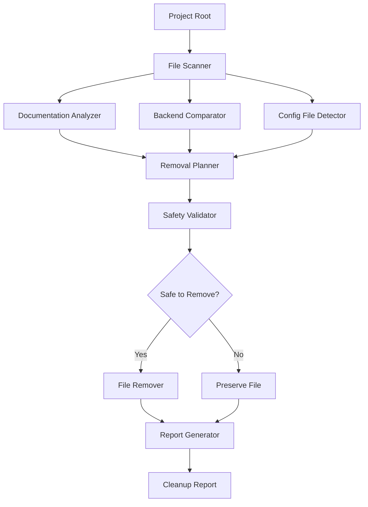

# Design Document: Project Cleanup System

## Overview

The Project Cleanup System is a file management utility designed to clean up a messy web application project by identifying and removing duplicate, redundant, and obsolete files while preserving all functionality. The system addresses three main problem areas:

1. **Documentation Overload**: 30+ markdown documentation files in the project root covering overlapping topics (database fixes, deployment guides, payment setup, login troubleshooting)
2. **Duplicate Backend Folders**: Two backend folders (`backend/` and `Backend-Draftin-Clean/`) with different structures and content
3. **Duplicate Configuration Files**: Copy files like `package - Copy.json` and `vite.config - Copy.ts` in the frontend

The system operates as a command-line tool that analyzes the project structure, categorizes files, identifies redundancies, and safely removes unnecessary files while generating a comprehensive cleanup report.

### Key Design Principles

- **Safety First**: Never remove active code or essential configuration files
- **Transparency**: Generate detailed reports of all actions taken
- **Reversibility**: Leverage git for recovery if needed
- **Minimal Disruption**: Preserve existing folder structures and web application functionality

## Architecture

The system follows a pipeline architecture with four main stages:

```
Analysis → Planning → Validation → Execution
```

### Stage 1: Analysis
Scans the project to identify:
- All documentation files and their topics
- Duplicate backend folders and their differences
- Duplicate configuration files
- Active code paths and dependencies

### Stage 2: Planning
Creates a removal plan by:
- Categorizing files by type and redundancy
- Determining which backend folder is active
- Identifying files safe to remove
- Prioritizing removal order

### Stage 3: Validation
Verifies safety by:
- Checking for import/require statements referencing files to be removed
- Ensuring essential files are preserved
- Validating that active code remains intact

### Stage 4: Execution
Performs cleanup by:
- Removing files in logical order (documentation → configs → folders)
- Generating a detailed cleanup report
- Providing recovery instructions

### System Architecture Diagram



## Components and Interfaces

### 1. FileScanner

**Responsibility**: Recursively scan project directories and identify all files

**Interface**:
```javascript
class FileScanner {
  scanProject(rootPath)
  // Returns: { documentationFiles, backendFolders, configFiles, essentialFiles }
  
  isDocumentationFile(filePath)
  // Returns: boolean
  
  isEssentialFile(filePath)
  // Returns: boolean
}
```

**Implementation Notes**:
- Uses Node.js `fs` module for file system operations
- Excludes `.git/`, `node_modules/`, and `.kiro/` from scanning
- Identifies documentation files by `.md`, `.txt` extensions in project root
- Marks essential files: `.env`, `package.json`, `package-lock.json`, `.gitignore`, `index.js`, `index.html`

### 2. DocumentationAnalyzer

**Responsibility**: Categorize documentation files by topic and identify redundancies

**Interface**:
```javascript
class DocumentationAnalyzer {
  categorizeDocuments(documentationFiles)
  // Returns: Map<topic, File[]>
  
  identifyRedundant(categorizedDocs)
  // Returns: { toKeep: File[], toRemove: File[] }
  
  extractTopic(fileName)
  // Returns: string (topic category)
}
```

**Topic Categories**:
- `database-fixes`: Files containing "DATABASE", "MONGODB", "CONNECTION"
- `login-fixes`: Files containing "LOGIN", "AUTH"
- `deployment`: Files containing "DEPLOY", "HOSTINGER", "PRODUCTION"
- `payment-setup`: Files containing "MIDTRANS", "PAYMENT"
- `general-setup`: Files containing "SETUP", "QUICK", "START", "CHECKLIST"
- `troubleshooting`: Files containing "TROUBLESHOOTING", "FIX", "PROBLEM"

**Redundancy Logic**:
- Within each category, keep the most recent or most comprehensive file
- "INDEX" files take priority (e.g., `DATABASE_FIX_INDEX.md`)
- Files with "SUMMARY" or "GUIDE" in name are preferred over "FIX" or "PROBLEM"
- Older files with overlapping content are marked for removal

### 3. BackendComparator

**Responsibility**: Compare backend folders and determine which is active

**Interface**:
```javascript
class BackendComparator {
  compareBackends(backend1Path, backend2Path)
  // Returns: { differences, uniqueFiles, activeBackend }
  
  identifyActiveBackend(backend1, backend2)
  // Returns: string (path to active backend)
  
  findUniqueFiles(activeBackend, obsoleteBackend)
  // Returns: File[]
}
```

**Active Backend Detection Logic**:
1. Check for `node_modules/` presence (indicates recent `npm install`)
2. Check `.env` file modification time (more recent = more active)
3. Compare file counts in models/, routes/, controllers/ (more files = more complete)
4. Check for `uploads/` directory with content (indicates active usage)

**Key Observations from Analysis**:
- `backend/` has `node_modules/` and `uploads/` directories → likely active
- `Backend-Draftin-Clean/` has more models (12 vs 4) and routes (13 vs 5) → more complete feature set
- `Backend-Draftin-Clean/` has its own `.git/` folder → separate repository
- Need to determine which backend the frontend actually connects to

### 4. ConfigFileDetector

**Responsibility**: Identify duplicate configuration files

**Interface**:
```javascript
class ConfigFileDetector {
  findDuplicateConfigs(files)
  // Returns: { originals: File[], copies: File[] }
  
  isDuplicateConfig(fileName)
  // Returns: boolean
}
```

**Detection Logic**:
- Files containing " - Copy" in the name are duplicates
- Original file must exist (without " - Copy")
- Common patterns: `package - Copy.json`, `vite.config - Copy.ts`

### 5. RemovalPlanner

**Responsibility**: Create a safe removal plan with prioritized order

**Interface**:
```javascript
class RemovalPlanner {
  createPlan(analysisResults)
  // Returns: RemovalPlan
  
  prioritizeRemovals(filesToRemove)
  // Returns: File[] (ordered by priority)
}
```

**Removal Order Priority**:
1. Documentation files (lowest risk)
2. Duplicate configuration files (medium risk)
3. Obsolete backend folder (highest risk, done last)

**RemovalPlan Structure**:
```javascript
{
  documentationToRemove: File[],
  configsToRemove: File[],
  backendToRemove: string,
  uniqueFilesToCopy: File[],
  estimatedSpaceFreed: number,
  totalFilesAffected: number
}
```

### 6. SafetyValidator

**Responsibility**: Validate that removals won't break the application

**Interface**:
```javascript
class SafetyValidator {
  validateRemovalPlan(plan)
  // Returns: { safe: boolean, issues: string[] }
  
  checkForReferences(filePath, codebase)
  // Returns: string[] (files that reference this path)
  
  verifyEssentialFilesPreserved(plan)
  // Returns: boolean
}
```

**Validation Checks**:
1. No essential files in removal list
2. No import/require statements reference files to be removed
3. Active backend folder is not marked for removal
4. At least one backend folder remains after cleanup
5. Frontend folder remains untouched (except duplicate configs)

**Reference Checking**:
- Search for `require('path')`, `import from 'path'` in all `.js`, `.ts`, `.jsx`, `.tsx` files
- Check for relative path references in configuration files
- Verify no package.json scripts reference files to be removed

### 7. FileRemover

**Responsibility**: Execute file and folder deletions

**Interface**:
```javascript
class FileRemover {
  removeFiles(removalPlan)
  // Returns: { removed: File[], failed: File[], errors: Error[] }
  
  removeDirectory(dirPath)
  // Returns: boolean
  
  copyFile(source, destination)
  // Returns: boolean
}
```

**Execution Logic**:
1. Copy unique files from obsolete backend to active backend (if any)
2. Remove documentation files one by one
3. Remove duplicate configuration files
4. Remove obsolete backend folder and all contents
5. Track success/failure for each operation

### 8. ReportGenerator

**Responsibility**: Generate comprehensive cleanup report

**Interface**:
```javascript
class ReportGenerator {
  generateReport(removalResults, plan)
  // Returns: string (markdown formatted report)
  
  calculateSpaceFreed(removedFiles)
  // Returns: number (bytes)
  
  categorizeRemovals(removedFiles)
  // Returns: Map<category, File[]>
}
```

**Report Contents**:
- Summary statistics (files removed, space freed)
- Categorized list of removed files with reasons
- List of preserved essential files
- Active backend identified
- Recovery instructions using git
- Warnings or issues encountered

## Data Models

### File

```javascript
{
  path: string,              // Relative path from project root
  name: string,              // File name with extension
  size: number,              // Size in bytes
  modifiedTime: Date,        // Last modification timestamp
  type: string,              // 'documentation' | 'config' | 'code' | 'essential'
  category: string,          // Topic category for documentation
  isEssential: boolean       // Whether file is required for app functionality
}
```

### RemovalPlan

```javascript
{
  documentationToRemove: File[],
  configsToRemove: File[],
  backendToRemove: string,
  uniqueFilesToCopy: Array<{source: string, destination: string}>,
  estimatedSpaceFreed: number,
  totalFilesAffected: number,
  removalOrder: string[]     // Ordered list of file paths
}
```

### CleanupReport

```javascript
{
  timestamp: Date,
  summary: {
    totalFilesRemoved: number,
    totalSpaceFreed: number,
    documentationRemoved: number,
    configsRemoved: number,
    foldersRemoved: number
  },
  removedFiles: Array<{
    path: string,
    reason: string,
    category: string,
    size: number
  }>,
  preservedFiles: string[],
  activeBackend: string,
  warnings: string[],
  recoveryInstructions: string
}
```

### AnalysisResults

```javascript
{
  documentationFiles: File[],
  categorizedDocs: Map<string, File[]>,
  backendFolders: string[],
  backendComparison: {
    backend1: string,
    backend2: string,
    differences: string[],
    activeBackend: string,
    uniqueFiles: File[]
  },
  duplicateConfigs: {
    originals: File[],
    copies: File[]
  },
  essentialFiles: File[]
}
```


## Correctness Properties

*A property is a characteristic or behavior that should hold true across all valid executions of a system—essentially, a formal statement about what the system should do. Properties serve as the bridge between human-readable specifications and machine-verifiable correctness guarantees.*

### Property Reflection

After analyzing all acceptance criteria, several redundancies were identified:

**Redundancies Eliminated**:
- Property 2.2 (preserve most recent file) is the inverse of 2.1 (remove older files) - combined into Property 2
- Property 3.4 (unique files in specific folder) is a specific case of 3.3 (list all differences) - covered by Property 3
- Property 6.2 (preserve originals) is the inverse of 6.1 (remove copies) - combined into Property 6
- Property 6.3 (verify config references) is the same validation as 5.4 - covered by Property 5
- Property 7.2 (.gitignore preservation) overlaps with 5.2 (essential files) - covered by Property 7
- Property 7.3 (preserve git history) is the same as 7.1 (don't remove .git/) - combined into Property 7
- Property 10.3 (preserve folder hierarchy) is similar to 10.2 (don't reorganize) - combined into Property 10

### Property 1: Documentation File Discovery

*For any* project directory containing documentation files, scanning the project root should discover all files with `.md` or `.txt` extensions, excluding files in `.git/`, `node_modules/`, and `.kiro/` directories.

**Validates: Requirements 1.1**

### Property 2: Redundancy Detection and Removal

*For any* set of documentation files categorized by topic, when multiple files cover the same topic, the system should identify them as redundant and mark older or less comprehensive versions for removal while preserving the most recent or comprehensive file.

**Validates: Requirements 1.2, 2.1, 2.2**

### Property 3: Documentation Categorization

*For any* documentation file name, the system should categorize it into exactly one topic category (database-fixes, login-fixes, deployment, payment-setup, general-setup, or troubleshooting) based on keywords in the filename.

**Validates: Requirements 1.3**

### Property 4: Redundancy Report Completeness

*For any* set of redundant documentation files identified, the generated report should list all redundant files with their assigned categories.

**Validates: Requirements 1.4**

### Property 5: Content Consolidation

*For any* set of documentation files within the same topic category, if multiple files contain unique information, the system should consolidate them into a single file before marking duplicates for removal.

**Validates: Requirements 2.3**

### Property 6: Directory Comparison

*For any* two directories, the system should identify all file differences including files unique to each directory, files with different content, and files with different modification times.

**Validates: Requirements 3.3, 3.4**

### Property 7: Active Backend Detection

*For any* pair of backend folders, the system should identify which folder contains the active code by checking for indicators (node_modules presence, .env modification time, uploads directory with content, file completeness).

**Validates: Requirements 3.2**

### Property 8: Obsolete Folder Marking

*For any* pair of backend folders where one is identified as active, the system should mark the non-active folder for removal.

**Validates: Requirements 4.1**

### Property 9: Unique File Preservation

*For any* obsolete backend folder containing unique essential files not present in the active backend, the system should copy those files to the active backend before marking the obsolete folder for removal.

**Validates: Requirements 4.2**

### Property 10: Folder Removal Completeness

*For any* backend folder marked for removal, the system should remove the folder and all its contents, and verify that only one backend folder remains after removal.

**Validates: Requirements 4.3, 4.4**

### Property 11: Active Code Preservation Invariant

*For any* cleanup operation, the system should never remove files from the frontend/ directory or the active backend folder's code directories (controllers/, models/, routes/, middleware/, utils/, src/, public/, dist/).

**Validates: Requirements 5.1, 5.3**

### Property 12: Essential File Preservation Invariant

*For any* cleanup operation, the system should never remove essential files including .env, package.json, package-lock.json, .gitignore, index.js, index.html, or any configuration files without "Copy" in their names.

**Validates: Requirements 5.2**

### Property 13: Reference Validation

*For any* file marked for removal, the system should scan all code files (.js, .ts, .jsx, .tsx) for import/require statements or path references to that file, and if any references exist, the file should not be removed.

**Validates: Requirements 5.4, 6.3**

### Property 14: Duplicate Configuration Removal

*For any* configuration file with " - Copy" in its name, if the original file (without " - Copy") exists, the system should mark the copy for removal and preserve the original.

**Validates: Requirements 6.1, 6.2**

### Property 15: Git Preservation Invariant

*For any* cleanup operation, the system should never remove the .git/ folder, any of its contents, or .gitignore files from any directory.

**Validates: Requirements 7.1, 7.2, 7.3**

### Property 16: Cleanup Report Generation

*For any* completed cleanup operation, the system should generate a report that lists all removed files, categorizes them by type (documentation, duplicate folders, obsolete files, duplicate configs), includes the reason for each removal, and reports total files removed and disk space freed.

**Validates: Requirements 8.1, 8.2, 8.3, 8.4**

### Property 17: Preview Before Execution

*For any* cleanup plan, the system should generate a complete list of files to be removed before executing any deletions.

**Validates: Requirements 9.1**

### Property 18: Execution Order Consistency

*For any* cleanup operation, the system should execute removals in the order: documentation files first, then duplicate configuration files, then obsolete backend folders last.

**Validates: Requirements 9.4**

### Property 19: Clean Project Root Post-Condition

*For any* completed cleanup operation, the project root should contain only essential files and active folders (backend/, frontend/, .git/, .kiro/), with no duplicate folders or excessive documentation files.

**Validates: Requirements 10.1**

### Property 20: Structure Preservation Invariant

*For any* cleanup operation, the system should not create new folders or reorganize existing folder structures, preserving the folder hierarchy for frontend/ and backend/.

**Validates: Requirements 10.2, 10.3**

## Error Handling

### Error Categories

**1. File System Errors**
- **Permission Denied**: User lacks permissions to read/write/delete files
- **File Not Found**: File was moved or deleted during operation
- **Disk Full**: Insufficient space for file operations
- **File Locked**: File is in use by another process

**Handling Strategy**:
- Catch all file system errors and log them with full context
- Continue with remaining operations when possible
- Report all failures in the cleanup report
- Provide specific recovery instructions for each error type

**2. Validation Errors**
- **Active Backend Not Found**: Cannot determine which backend is active
- **References Found**: File to be removed is referenced by active code
- **Essential File in Removal List**: Safety check failed

**Handling Strategy**:
- Abort cleanup operation immediately
- Report validation failure with detailed explanation
- Provide manual review instructions
- Do not proceed with any deletions

**3. Analysis Errors**
- **Empty Project**: No files found to analyze
- **No Backend Folders**: Expected backend folders not found
- **Malformed Files**: Cannot parse or read file contents

**Handling Strategy**:
- Report analysis failure with specific error
- Provide guidance on expected project structure
- Allow user to fix issues and retry

**4. User Cancellation**
- **Confirmation Declined**: User chooses not to proceed with cleanup

**Handling Strategy**:
- Exit gracefully without making any changes
- Preserve the removal plan for future reference
- Provide option to review plan and retry

### Error Recovery

**Git-Based Recovery**:
```bash
# If cleanup causes issues, recover using git
git status                    # See what was deleted
git checkout -- <file>        # Restore specific file
git reset --hard HEAD         # Restore all deleted files
```

**Backup Strategy**:
- Recommend users commit all changes before running cleanup
- Provide pre-cleanup checklist in documentation
- Include git status check in the tool

**Graceful Degradation**:
- If backend comparison fails, skip backend cleanup but continue with documentation
- If report generation fails, output results to console
- If consolidation fails, skip consolidation but continue with simple removal

## Testing Strategy

### Dual Testing Approach

The Project Cleanup System will use both unit tests and property-based tests to ensure comprehensive coverage:

**Unit Tests**: Focus on specific examples, edge cases, and integration points
- Test specific file patterns (e.g., "package - Copy.json")
- Test error conditions (permission denied, file not found)
- Test the actual project structure with known files
- Test user interaction flows (confirmation, cancellation)

**Property-Based Tests**: Verify universal properties across all inputs
- Test with randomly generated file structures
- Test with various documentation file naming patterns
- Test with different backend folder configurations
- Test with random sets of duplicate files

### Property-Based Testing Configuration

**Framework**: fast-check (JavaScript/Node.js property-based testing library)

**Configuration**:
- Minimum 100 iterations per property test
- Each test tagged with format: **Feature: project-cleanup, Property {number}: {property_text}**
- Use custom generators for file structures, documentation names, and directory trees

**Example Property Test Structure**:
```javascript
// Feature: project-cleanup, Property 1: Documentation File Discovery
fc.assert(
  fc.property(
    fc.array(fc.record({
      name: fc.string(),
      extension: fc.constantFrom('.md', '.txt'),
      path: fc.constantFrom('root', 'root/subdir')
    })),
    (files) => {
      const scanner = new FileScanner();
      const rootFiles = files.filter(f => f.path === 'root');
      const discovered = scanner.scanProject(testDir);
      return discovered.length === rootFiles.length;
    }
  ),
  { numRuns: 100 }
);
```

### Unit Test Coverage

**FileScanner Tests**:
- Test scanning project root with known files
- Test exclusion of .git/, node_modules/, .kiro/
- Test identification of documentation files by extension
- Test identification of essential files by name

**DocumentationAnalyzer Tests**:
- Test categorization with specific file names
- Test redundancy detection with known duplicate sets
- Test consolidation with files containing unique content
- Test edge case: empty project, single file, all unique files

**BackendComparator Tests**:
- Test comparison of actual backend/ and Backend-Draftin-Clean/ folders
- Test active backend detection with various indicators
- Test unique file identification
- Test edge case: identical folders, one empty folder

**SafetyValidator Tests**:
- Test validation with files that have references
- Test validation with essential files in removal list
- Test validation with active code in removal list
- Test edge case: no files to remove, all files safe

**FileRemover Tests**:
- Test file removal with temporary test files
- Test directory removal with nested structure
- Test file copying before removal
- Test error handling: permission denied, file not found

**ReportGenerator Tests**:
- Test report generation with known removal results
- Test space calculation with known file sizes
- Test categorization of removed files
- Test markdown formatting of report

### Integration Tests

**End-to-End Cleanup Test**:
1. Create a test project structure mimicking the actual project
2. Run complete cleanup operation
3. Verify expected files are removed
4. Verify expected files are preserved
5. Verify report is generated correctly

**Safety Integration Test**:
1. Create test project with files that reference each other
2. Attempt to remove referenced files
3. Verify validation prevents removal
4. Verify error is reported correctly

**Backend Consolidation Test**:
1. Create two backend folders with unique files in each
2. Run cleanup operation
3. Verify unique files are copied to active backend
4. Verify obsolete backend is removed
5. Verify only one backend remains

### Test Data Generators

**For Property-Based Tests**:

```javascript
// Generate random documentation file names
const docFileNameGen = fc.record({
  prefix: fc.constantFrom('DATABASE', 'LOGIN', 'DEPLOY', 'MIDTRANS', 'SETUP', 'FIX'),
  suffix: fc.constantFrom('GUIDE', 'FIX', 'TROUBLESHOOTING', 'SUMMARY', 'INDEX'),
  extension: fc.constantFrom('.md', '.txt')
});

// Generate random directory structures
const dirStructureGen = fc.array(
  fc.record({
    path: fc.array(fc.string(), { minLength: 1, maxLength: 3 }),
    files: fc.array(fc.string())
  })
);

// Generate random backend folder configurations
const backendConfigGen = fc.record({
  hasNodeModules: fc.boolean(),
  hasUploads: fc.boolean(),
  envModifiedTime: fc.date(),
  modelCount: fc.integer({ min: 0, max: 20 }),
  routeCount: fc.integer({ min: 0, max: 20 })
});
```

### Test Execution

**Running Tests**:
```bash
# Run all tests
npm test

# Run only unit tests
npm run test:unit

# Run only property-based tests
npm run test:property

# Run with coverage
npm run test:coverage
```

**Continuous Integration**:
- Run all tests on every commit
- Require 80% code coverage minimum
- Run property tests with 100 iterations in CI
- Run extended property tests (1000 iterations) nightly

### Manual Testing Checklist

Before release, manually verify:
- [ ] Run cleanup on actual project and verify web app still works
- [ ] Verify frontend can connect to backend after cleanup
- [ ] Verify all essential files are preserved
- [ ] Verify git history is intact
- [ ] Verify report is accurate and readable
- [ ] Test recovery instructions work correctly
- [ ] Test with different user permissions
- [ ] Test cancellation at confirmation step

